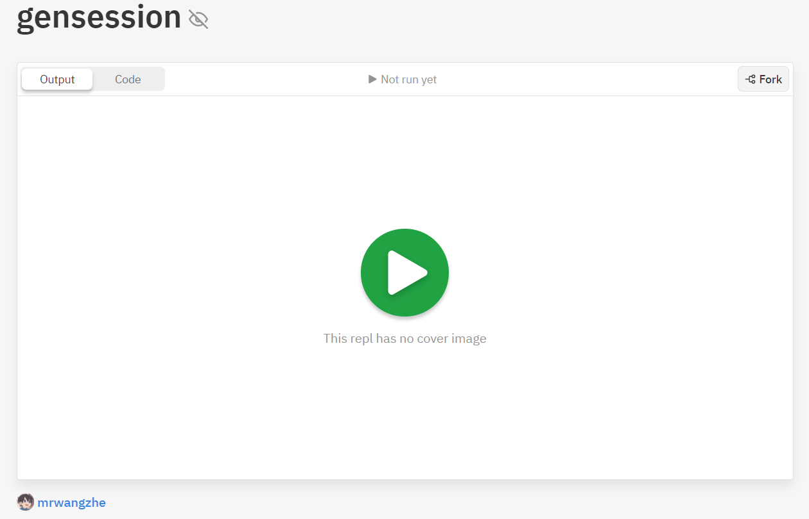
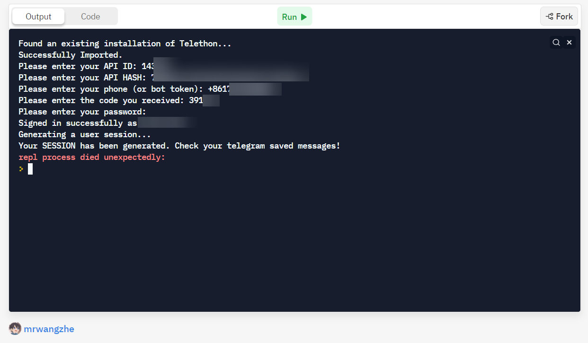
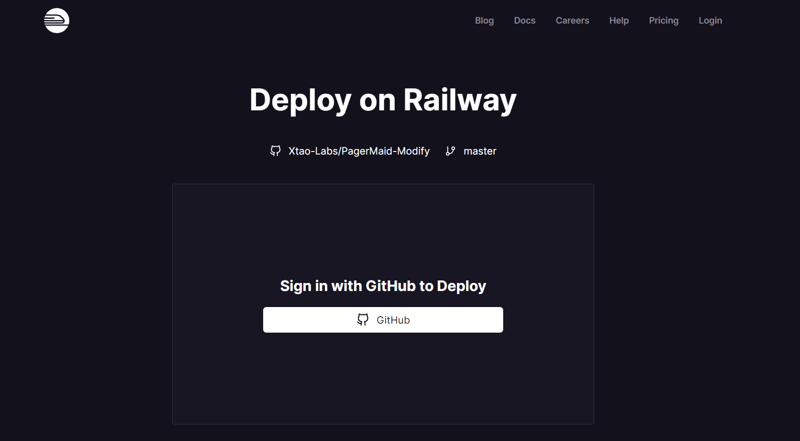
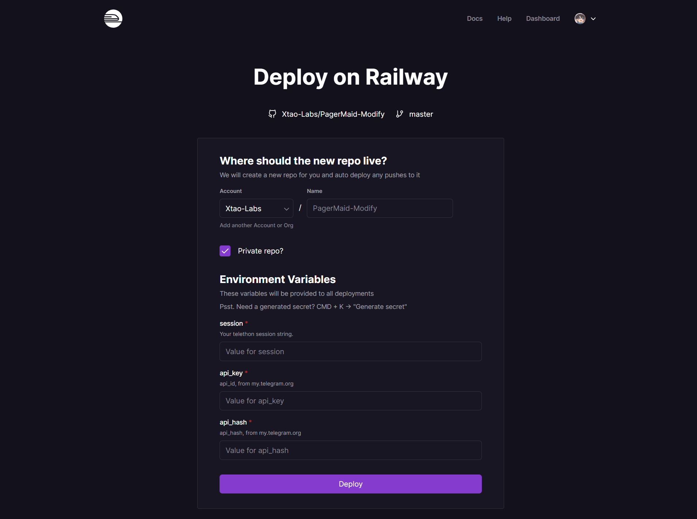
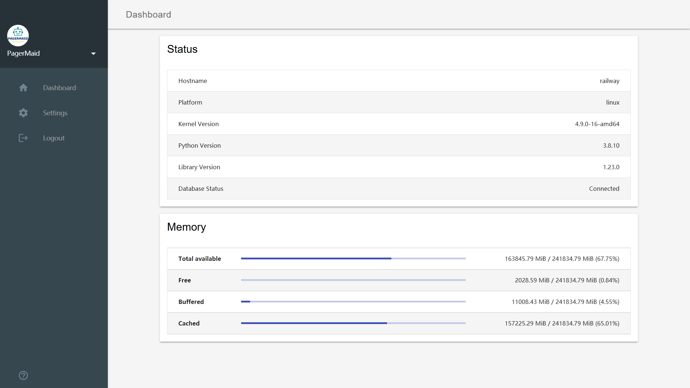

# Railway

经典的云部署解决方案。仅需要一个注册时长超过一个月的 github 账号即可使用。

# 准备

## 获取 API

### 通过 Telegram 机器人

Telegram 客户端私聊 [@PagerMaid_Modify_bot](https://t.me/PagerMaid_Modify_bot) 
发送 `/app` 来快速注册 [my.telegram.org](https://my.telegram.org) 上的应用详情。

!> 不保证稳定性，自行承担使用风险

!> 请勿将此应用详情发送给其他人！


### 通过官网

打开 [my.telegram.org](https://my.telegram.org) 输入手机号、验证码登录，
选择 `API development tools` 开始 API 申请流程。

> 所有选项均不要求指定内容。

## 获取 Session

!> 这是您账户的授权文件，请妥善保管

### 在线获取

[](https://replit.com/@mrwangzhe/gensession)

点击上方按钮打开模拟运行网页，加载完成后点击屏幕中央的播放按钮开始运行。



?> 点击开始后如果卡住不动，请检查是否开启代理

输入上一步获取到的 `API_ID` 和 `API_HASH`，`电话号码`。



登录完毕后，你就可以在你 Telegram 账户的 `收藏夹` 中看到你的 Session 了

### 本地获取

你需要自行在本地安装 `python3` ，然后克隆仓库后运行以下命令：

```bash
cd utils && python3 -m pip install telethon && python3 gensession.py
```

输入上一步获取到的 `API_ID` 和 `API_HASH`，`电话号码`。


登录完毕后，你就可以在你 Telegram 账户的 `收藏夹` 中看到你的 Session 了

# 部署

[](https://railway.app/new/template?template=https%3A%2F%2Fgithub.com%2FXtao-Labs%2FPagerMaid-Modify%2Ftree%2Fmaster&envs=session%2Capi_key%2Capi_hash&sessionDesc=Your+telethon+session+string.&api_keyDesc=api_id%2C+from+my.telegram.org&api_hashDesc=api_hash%2C+from+my.telegram.org&referralCode=xtaolabs)

## 登录

!> Github 账号注册时长需超过一个月

首次打开上方链接，您需要登录您的 Github 账号开始部署。



## 配置

填入准备过程中已经获取到的 `API_ID`、`API_HASH`、`Session` 然后点击 `Deploy` 即可完成部署，开始使用。



# 使用

## 网页状态面板

[点击链接](https://railway.app/dashboard) 选择项目，选择 `Deployments` 点击 `Domains` 。访问 `xxx.up.railway.app` 即可开始配置。



## 查看程序日志

[点击链接](https://railway.app/dashboard) 选择项目，选择 `Deployments` 点击 `Success` 。向下滑动即可查看程序运行日志。

## 查看占用

[点击链接](https://railway.app/dashboard) 选择项目，选择 `Metrics` 即可查看程序占用、流量使用情况。

## 免费吗？

[点击链接](https://railway.app/account/billing) ，只要 `Estimated Month's Usage` 的值小于 `5` 即可实现永久免费使用。

!> 不保证官方不会调整/取消免费计划等情况

## 配置？

免费版可以使用 `512 MB` 的内存，按量付费的 CPU，`1 GB` 的磁盘。

## 重启

暂不支持

## 不想用了？

删除项目即可
